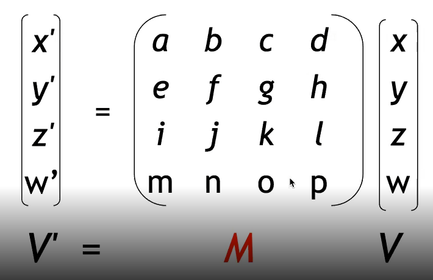
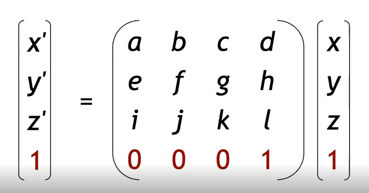
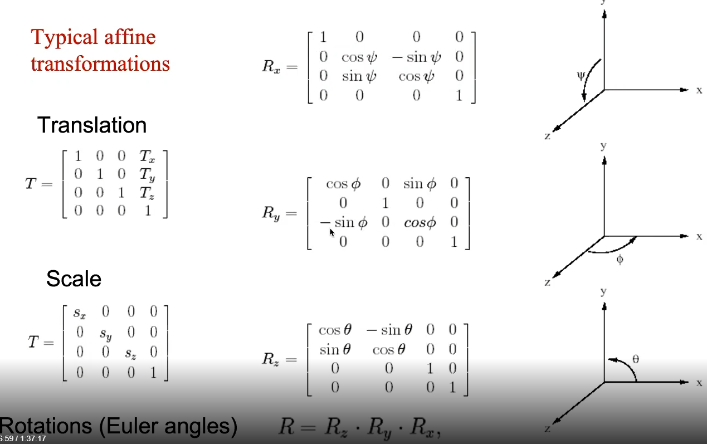
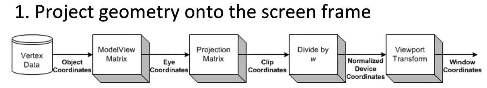
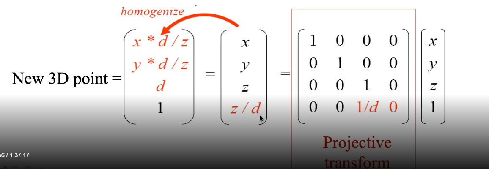
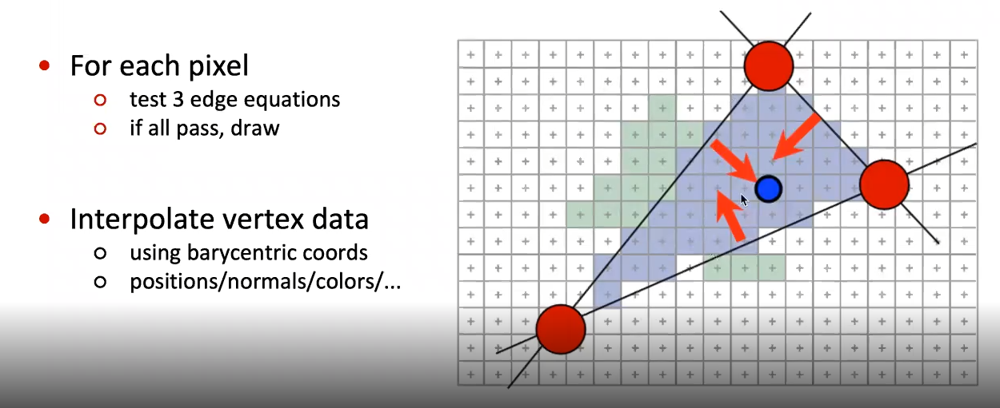
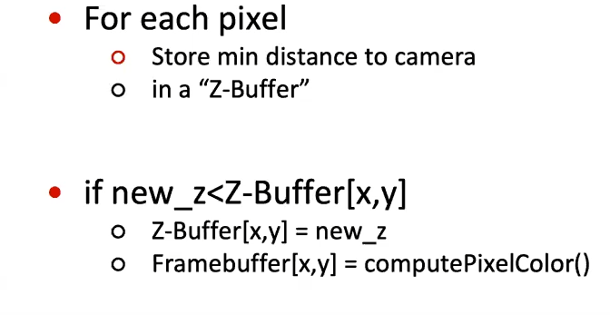
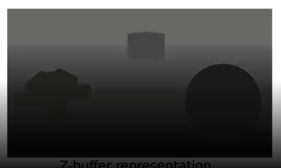
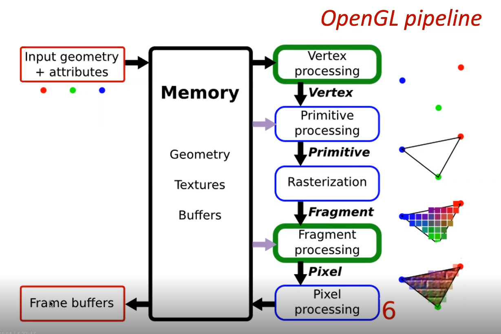

# 1 - Graphics projective pipeline

On ne peut pas décrire des translations dans un espace vectorielle 3D

Par contre on peut décrire des rotations.

Du coup on a créer un outil pour décrire n'importe quelle transformation en 3D, enfait on passe en 4D.

On ajoute la **coordonnée d'échelle** pour passer en **géométrie projective**

*Géométrie projective*

$(x',y',z',w')= \text{coordonnées homogènes}$

On a grâce à cette coordonnée d'échelle, une infinité de coordonnées qui peuvent représenter le même point 3D.

-

## Les transformations affines

Lorsque l'on met **w**  à 1, on peut représenter une translation :

ça donne :

$$
\begin{pmatrix}
a & b & c & d \\
e & f & g & h \\
i & j & k & l \\
0 & 0 & 0 & 1
\end{pmatrix} = 
\begin{pmatrix}
xa+yb+zc+d \\
xe+yf+zg+h \\
xi+yj+zk+l\\
0+0+0+1
\end{pmatrix}
$$

On a bien la translation sur la dernière colonne

Voici une représentation de chaques transformations afinnes :

La quatrième colonne n'intervient pas dans les rotations.

Lorsque l'on applique plusieurs transformations il faut faire bien attention à l'ordre (dans le calcul la première effectuée est la plus à droite)

## Pipeline de projection sur l'écran

### Model/View matrix

On a deux transformations en réalité :

- On a la transformation qui ramène l'objet de son repère propre au repère monde.

- On la transformation qui fait la tranformation du repère monde vers le repère caméra

### Projection Matrix

C'est la projection de la vue de la caméra (pyramidale) sous la forme un cube (on pourra ensuite transformer ce cube en 2D comme on a vu avec la gémotérie projective).

### Divide by w

En divisant par w on repasse dans des coordonnées euclidiennes.

### Viewport Transform

On applique une nouvelle transformation pour adapter la matrice euclidienne à l'écran 

### Solution

On peut concatener ces transformations sous la forme d'une seule matrice

### Rasterization des triangles

Permet de donner des informations à des pixels.

### Test de visibilité

Permet de savoir si un élément est visinle ou non grace à un z-buffer. On a donc pour chaque pixel l'information de **profondeur**

### Calcul de la couleur des pixel

On calcul juste la couleur (avec des effets de lumière et tout)

## Pipeline OPENGL

